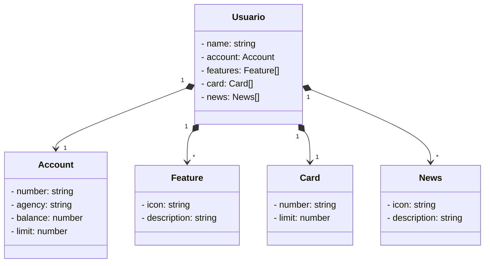

# Java RESTful API na nuvem.
Projeto do Santander Dev Week de 2023.

Para o Bootcamp Santander Back End com Java na DIO - Digital Innovation One.

## Diagrama de Classes

```mermaid
classDiagram
    class Usuario {
        - name: string
        - account: Account
        - features: Feature[]
        - card: Card[]
        - news: News[]
    }

    class Account {
        - number: string
        - agency: string
        - balance: number
        - limit: number
    }

    class Feature {
        - icon: string
        - description: string
    }

    class Card {
        - number: string
        - limit: number
    }

    class News {
        - icon: string
        - description: string
    }

    Usuario "1" *--> "1" Account
    Usuario "1" *--> "*" Feature
    Usuario "1" *--> "1" Card
    Usuario "1" *--> "*" News
```
